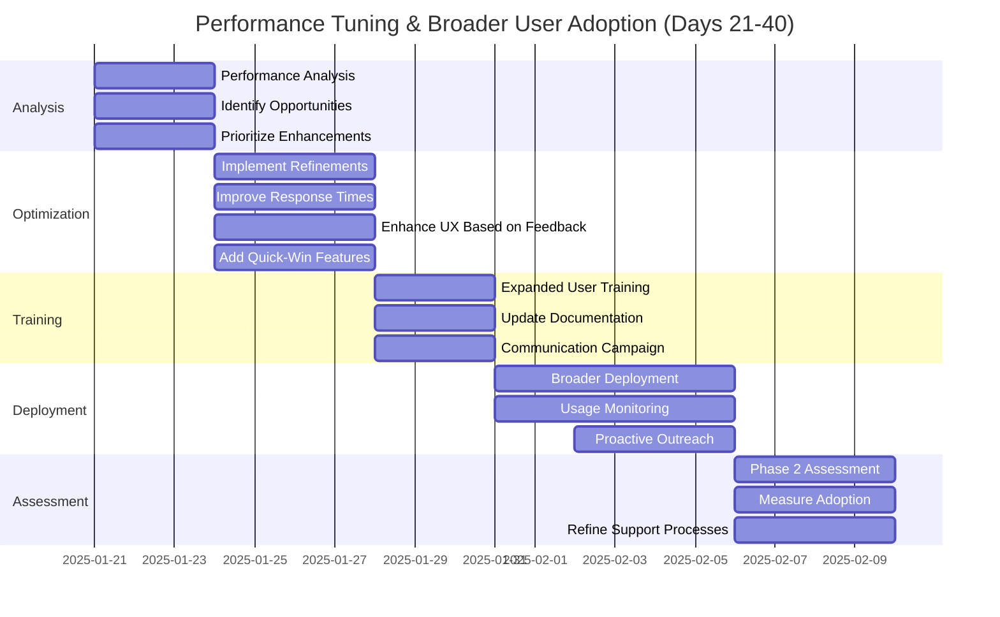
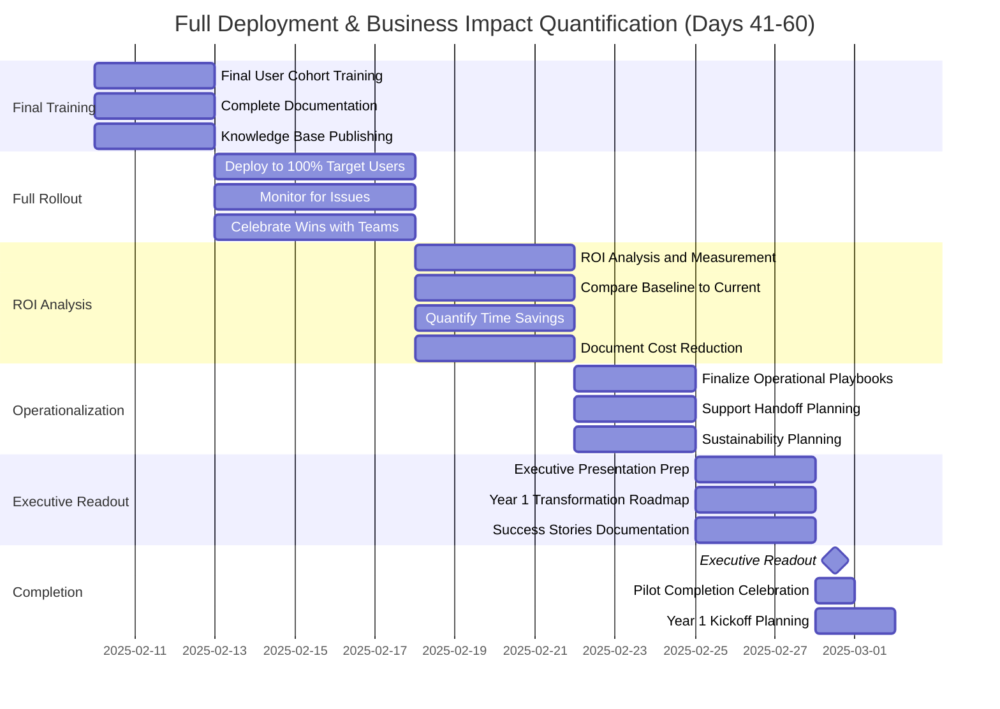

[M1](../m1/README.md) | [M2](../m2/README.md) | [M3](../m3/README.md) | [Day 1](../day1/README.md) | [POC](../poc/README.md) | [Pilot](../pilot/README.md) | [Program](../program/README.md) | [Partnership](../partnership/README.md)

# PILOT: 60-Day Roadmap

**Production Pilot — Deploy, Optimize, Scale**

---

**Duration:** 60 days  
**Investment:** $150,000  
**Objective:** Production deployment with measured impact  

---

## Pilot Purpose

The 60-day Pilot phase moves validated POCs from prototype to production. This is the transition from "proof it works" to "prove the business value." By the end of 60 days, your solutions will be running in production, users will be trained and actively using them, and you'll have quantified, measurable ROI.

This phase establishes the foundation for enterprise-wide scaling in Year 1. We're not just deploying technology—we're building operational playbooks, change management processes, and the organizational muscle memory required for sustained transformation.

## ✓ Success Criteria

- Production deploymentcomplete with all validated POCs live and operational
- User adoption ≥ 70%of target user base actively using solutions weekly
- Measurable ROIdemonstrated: time savings, cost reduction, or revenue impact quantified
- Operational playbooksdocumented for all workflows
- Support infrastructurein place with SLAs and escalation paths
- Year 1 readinessconfirmed: technical foundation and organizational readiness for scale

---

## Focus 1: Performance Tuning & Broader User Adoption

**Objective:** Refine solutions based on real-world usage; expand to majority of target user base.

**Key Milestones:**
- **Day 23:** Performance analysis complete
- **Day 27:** Optimizations deployed
- **Day 30:** 60-80% users trained
- **Day 36:** Broader deployment complete
- **Day 40:** Phase 2 assessment complete

**Deliverable:** 60-80% user adoption; optimized performance; comprehensive support documentation; measurable efficiency gains

---

## Focus 2: Full Deployment & Business Impact Quantification

**Objective:** Complete rollout to all users; measure and document ROI; prepare for Year 1 transformation program.

**Key Milestones:**
- **Day 43:** Final training complete
- **Day 48:** 100% deployment achieved
- **Day 52:** ROI analysis complete
- **Day 55:** Operational playbooks finalized
- **Day 60:** Executive readout & Year 1 kickoff

**Deliverable:** 100% deployment; proven ROI documented; operational playbooks; Year 1 transformation roadmap; executive presentation

---

## Target ROI Metrics

- ≥30% time savings per user on target workflows
- ≥50% error reduction in automated tasks
- ≥70% user adoption (active weekly users)
- ≥80% user satisfaction (CSAT score)
- Payback period ≤12 months

---

[← Pilot Home](README.md) | [Main Index](../README.md)

---

---

[M1](../m1/README.md) | [M2](../m2/README.md) | [M3](../m3/README.md) | [Day 1](../day1/README.md) | [POC](../poc/README.md) | [Pilot](../pilot/README.md) | [Program](../program/README.md) | [Partnership](../partnership/README.md)
